<div align="center">

<h1><code>man@amnex</code> : <code>~/profile</code></h1>

<em>Associate Software Developer · Java · Spring Boot · Microservices</em>

<br/><br/>

<h3><code>$ cat contributions.log</code></h3>



<br/><br/>

<h3><code>$ whoami --verbose</code></h3>

<table>
  <tr>
    <td valign="top"></td>
    <td valign="top"></td>
  </tr>
</table>

<br/>

[](https://linkedin.com/in/ManPatel-07)
[](mailto:patelman7720@gmail.com)
[](https://github.com/ManPatel-07)

</div>

---

## `$ cat about.md`

```java
@Developer
public class ManPatel {

    private final String role     = "Associate Software Developer @ Amnex Infotechnologies";
    private final String focus    = "Microservices · Spring Boot · REST APIs · PostgreSQL";
    private final String mindset  = "Clean architecture, performance-first, production-ready";

    public String currentlyDoing() {
        return "Building scalable microservices with Eureka + API Gateway";
    }

    public String[] coreBeliefs() {
        return new String[]{
            "Readable code > clever code",
            "Design for scale from day one",
            "Every 30% performance gain matters in production"
        };
    }
}
```

- Associate Software Developer building microservices-based systems at **Amnex Infotechnologies** (Jun 2025–Present)
- Reduced API response times by **30%** through PostgreSQL query optimization
- Resolved **100+ production issues** across distributed backend services
- Previously built enterprise APIs for **Gujarat Seed Inspection** & **Punjab Agro** projects
- Hands-on with service discovery (Eureka), API Gateway, Spring Security, and clean REST design

---

## `$ ls skills/`

<div align="center">


</div>

---

## `$ ls projects/`

<div align="center">

<table>
<tr>
<td width="50%" valign="top">

### 📚 Library Management System


Full microservices architecture with **Eureka service discovery**, **API Gateway** routing, inter-service communication, and centralized configuration. Covers book inventory, member management, and loan tracking across independent services.

</td>
<td width="50%" valign="top">

### 🎓 Course Management System


Full-stack application with a **Spring Boot REST API** backend and **Angular** frontend. Features JWT authentication, role-based access control, course enrollment, and an admin dashboard.

</td>
</tr>
<tr>
<td width="50%" valign="top">

### 📄 Document Management System


Enterprise-grade document storage and retrieval system built with **Spring MVC + Hibernate + MySQL**. Supports upload, versioning, categorization, and role-based document access.

</td>
<td width="50%" valign="top">

### 🏛 College 3D Parallax Website


Immersive 3D parallax scrolling website with custom animations, layered depth effects, and a fully responsive layout built using Tailwind CSS and vanilla JS.

</td>
</tr>
</table>

</div>

---

## `$ cat experience.log`

```
┌─────────────────────────────────────────────────────────────────────┐
│  🏢  Amnex Infotechnologies                                         │
│      Associate Software Developer          Jun 2025 – Present       │
│      ▸ Built & maintained microservices-based production systems    │
│      ▸ Designed REST APIs with Eureka service discovery             │
│      ▸ Optimized PostgreSQL queries → 30% faster API responses      │
│      ▸ Resolved 100+ issues across distributed backend services     │
├─────────────────────────────────────────────────────────────────────┤
│  🏢  Amnex Infotechnologies                                         │
│      Java Spring Boot Intern               Aug 2024 – Feb 2025      │
│      ▸ Developed enterprise APIs with Spring Boot, Hibernate & JPA  │
│      ▸ Delivered features for Gujarat Seed Inspection project       │
│      ▸ Contributed to Punjab Agro production backend                │
├─────────────────────────────────────────────────────────────────────┤
│  🎨  Web Design Intern                     Jun 2024 – Jul 2024      │
│      ▸ Built ReactJS applications and responsive UI systems         │
└─────────────────────────────────────────────────────────────────────┘
```

---

<div align="center">

## `$ contact --open-to-work`

I'm open to backend roles, Java/Spring Boot opportunities, and microservices projects.

[](mailto:patelman7720@gmail.com)
&nbsp;
[](https://github.com/ManPatel-07)

<br/>

<sub><code>graph.svg</code> refreshes automatically every day via GitHub Actions · portrait &amp; panel rendered locally, no external badge services</sub>

</div>
